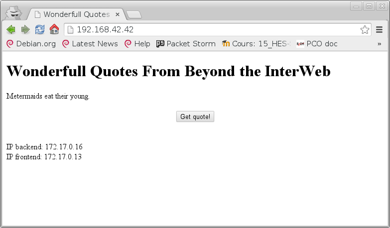

Introduction[^1]
================

Le but principal de ce laboratoire est d’apprendre à mettre en place une
architecture web, et de se familiariser avec des différents composants,
tels que les serveurs HTTP, les *load balancers* ou les *reverse
proxies*.

Il est également nécessaire de mettre en place un système de découverte
automatique de services permettant de “voire” si un serveur HTTP est
apparu ou a disparu de l’infrastructure et a réagir a ces changement en
modifiant automatiquement la configuration du *load balancer*.

Le tout est fait dans un environnement virtualisé en utilisant *Vagrant*
et *Docker*.

Architecture du système
=======================

Après nous être concertés pour déterminer le genre de services offerts
par l’architecture web, nous nous sommes entendus pour créer un
distributeur de citations générées par le programme UNIX *fortune*.

Détails des container
---------------------

### *Back-end*

Le *back-end* est un serveur HTTP répondant à chaque requête par un JSON
contenant une citation et l’adresse IP du back-end selon le motif
suivant:

`{quote:<citation>,ip:<IP du backend>}`

L’utilité de fournir l’adresse IP est de donner une preuve au testeur
que le *load-balancer* (décrit ci-après) fonctionne correctement.

Afin d’avoir un système le plus léger possible, et qui soit aisé à
implémenter, le *back-end* à été réalisé en javascript avec *Node.js*.

En parallèle, le *back-end* possède un *Heartbeat generator*, un
programme en javascript envoyant en continu toutes les 10 secondes un
message en UDP sur un port définit, sur l’adresse IP multicast définie
`224.1.1.1`. Ce message JSON contient les 2 champs suivants:

-   le type du client ( backend ou fronten )

-   l’ID du container *Docker*

### *Front-end*

Le *front-end* est un serveur HTTP répondant à chaque requête par un
page HTML contenant un javascript permettant de faire une requête pour
récupérer une citation. Cette requête sera redirigée vers le back-end
par le *reverse-proxy*. Afin de fournir une preuve au testeur que le
*load-balancer* fonctionne correctement, la page HTML générée contient
l’adresse IP du *front-end*.

Pour les même raisons que pour le *back-end*, le *front-end* à été
réalisé en javascript avec *Node.js*.

De la même manière que le *back-end*, le *front-end* possède lui aussi
un *heartbeat generator* envoyant des messages en continu sur l’adresse
multicast `224.1.1.1` et sur un port définit.

### *Node controller*

Le *node controller* (server) écoute sur un port et attend des paquet
entrant contenant 2 champs:

-   le type

-   l’ID du container *Docker*

Le contrôleur contient une structure de donnée `client` et un tableau de
client `clients[]`.

La structure de donnée `client` contient simplement des variable[^2]:
`ip`, `id`, `type`, `date`[^3], …

À l’arrivée d’un message pas un client le serveur crée un client avec la
structure décrite ci-dessus.

Si l’adresse IP du client qui vient d’envoyer le message n’est pas
contenu dans le tableau de clients que contient le serveur, le *node
controller* ajoute le client précédemment créé au tableau de clients,
met à jour le fichier de configuration d’*Apache* et redémarre le
*reverse proxy*. Sinon, si l’adresse IP du client est déjà contenue dans
le tableau, le *node controller* ne fait que mettre à jour le timestamp
du client en question, puis supprime le client précédemment créé.

En parallèle de ceci, Le serveur parcoure toutes les 5 seconde le
tableau de client et vérifie le *timestamp* de chaque client. Si le
temps écoulé depuis son arrivée dépasse 10 secondes, le *node controler*
retire le client de la liste et met à jour le fichier de configuration
d’*Apache* et redémarre le *reverse proxy*, sinon ne fait rien.

### *Reverse proxy et load balancer*

Nous avons choisi d’implémenter ce point grâce au service *httpd*
(*Apache 2*).

Le *reverse proxy* est le seul point d’entrée extérieur à notre
architecture. En effet il sert à masquer le fait qu’il y aie plusieurs
machines derrière une adresse, il se chargera de transmettre les
différentes requêtes au bon endroit et de retourner les réponses. Il
fait en même temps la distribution du travail (*load balancer*)
lorsqu’il a plusieurs possibilités vers qui envoyer une requête (parce
qu’on a plusieurs machines qui sont capables de faire la même chose,
plusieurs *front-end* et *back-end*) il va choisir de les distribuer
équitablement afin de partager le travail. Nous avons choisi ici
d’implémenter une méthode “Round-Robin”. La communication avec le
*front-end* est en *sticky session* avec un cookie qui permet de
spécifier la route (donc quel *front-end*) comme ça si un client a
commencé à communiquer avec un *front-end* il va continuer avec ce
*front-end* tant qu’il donne le cookie, si un nouveau client arrive
(sans cookie donc) le *load balancer* va le rediriger au prochain
*front-end* comme indiqué par notre police “Round-Robin”.

Le fichier de configuration du *reverse proxy* —*load balancer* est
généré par le *node controller* et est mis à jour à chaque changement
dans les services disponibles (nouveau *front-end* ou *back-end* ou bien
si un *front-end* ou *back-end* n’est plus disponible). Pour rendre
effectif la modification nous relançons la machine depuis le *node
controller* (qui a les privilèges) avec *Dockerode*, dans le fichier de
configuration de *httpd* il est spécifié de charger notre fichier de
configuration spécifique qui est partagé entre le *node controller* et
cette machine.

Note: La route pour la *sticky session* est l’ID unique du container
vers qui la route pointe, ceci nous garantit que si la machine tombe et
se relance la route sera conservée, si on utilisais des entier (1, 2, 3,
…) si la machine 2 tombe et que la machine 3 prends la place du 2 la
route 2 renverrait vers une autre machine qu’auparavant. Avec les ID
uniques une route ne pointera que vers une seule machine et toujours la
même.

Protocoles de communications utilisés
-------------------------------------

Tous les échanges effectués entre les *front-end*s, les *back-end*s et
le *node controller* sont effectués par UDP et sont des JSONs.

Strategie de validation
=======================

Test du *load balancer*
-----------------------

Afin de tester que notre implémentation soit correcte, un web browser
(Google Chrome) a été utilisé pour ouvrir la page web, qui affiche aussi
bien l’adresse IP du *font-end* que celle du *back-end*. Lorsque la
quote était renouvellée en appuyant sur le bouton de la page web pour
renouveller les quotes, l’adresse IP du *back-end* était effectivement
modifiée. Par contre, si la page était rechargée, le *front-end* était
le même. Ce qui est normal, le cookie est conservé. En utilisant le mode
de navigation privée de Chrome, qui ne conserve pas les cookies, et
n’utilise pas de cache, l’adresse IP du *front-end* change avec un
rechargement de la page. Le *load balancer* fonctionne donc
correctement.

Test du *node controller*
-------------------------

Afin de tester si le système détecte l’apparition ou la disparition d’un
node, un container *Docker* est supprimé, dans les quelques secondes
suivantes, la configuration du *reverse proxy* est modifié pour prendre
en compte la disparition du nœud. Ensuite un nouveau container *Docker*
est créé. À nouveau, la configuration est modifiée pour prendre en
compte ces changements.

Marche à suivre pour valider l’architecture
-------------------------------------------

### Mise en place

1.  Lancer Vagrant dans le repertoire ou se trouve le fichier
    `Vagrantfile`.\
    `$ vagrant up`

2.  Se logger dans vagrant.\
    `$ vagrant ssh`

3.  Créer les images *Docker* à l’aide des scripts fournis.\
    `$ cd /vagrant/backend`\
    `$ ./createDockerImage.sh`\
    `$ cd /vagrant/frontend`\
    `$ ./createDockerImage.sh`\
    `$ cd /vagrant/node-controller`\
    `$ ./createDockerImage.sh`\
    `$ cd /vagrant/reverse-proxy-lb`\
    `$ ./createDockerImage.sh`

4.  (facultatif) Si on veut visulaiser les container *Docker* avec une
    interface graphique, on peut aussi construire l’image *DockerUI*\
    `$ cd /vagrant/dockerUI`\
    `$ ./createDockerImage.sh`

5.  Lancer les container *Docker* à l’aide des scripts fournis. (Notons
    qu’il faut fournir un nom pour les back-ends et front-ends)\
    `$ cd /vagrant/backend`\
    `$ ./startContainers.sh backend1`\
    `$ ./startContainers.sh backend2`\
    `$ cd /vagrant/frontend`\
    `$ ./startContainers.sh frontend1`\
    `$ ./startContainers.sh frontend2`\
    `$ ./startContainers.sh frontend3`\
    `$ cd /vagrant/node-controller`\
    `$ ./startContainers.sh`\
    `$ cd /vagrant/reverse-proxy-lb`\
    `$ ./startContainers.sh`

6.  (facultatif) Si on veut utiliser DockerUI, il faut aussi lancer un
    container.\
    `$ cd /vagrant/dockerUI`\
    `$ ./startContainers.sh`

### Test du *back-end*, du *front-end*, et du *reverse proxy*

1.  Lancer un navigateur web (par exemple Google Chrome) et entrer l’url
    `192.168.42.42` en utilisant le port standard (80). Nous pouvons
    voire l’adresse IP du front-end et du back-end.

À présent nous sommes sûr que le *back-end*, le *front-end*, et le
*reverse proxy* fonctionnent.

### Test du load balancer

1.  Appuyer plusieurs fois sur le boutton “*Get quote!*”. Nous pouvons
    voire que l’adresse IP du front-end reste fixe, mais que celle du
    back-end change.

2.  Recharger plusieurs fois la page après avoir éliminé les cookies du
    navigateur. Nous observons que l’adresse IP du front-end est aussi
    modifiée.

  --------------------- ---------------------
      
      
  --------------------- ---------------------

À présent nous sommes sûr que le *load balancer* fonctionne.

### Test du node balancer

1.  Nous démarrons des nouveaux *back-end*s ou des nouveaux
    *front-end*s. Après quelques secondes, ils sont trouvés par le *node
    balancer*, et peuvent être utilisés.

2.  Nous supprimons des *back-end*s ou des *front-end*s Après quelques
    secondes, le *node balancer* a reconfiguré le *load balancer* pour
    prendre en compte le nouvel état du système. Il est possible de lire
    ce fichier, qui se trouve dans le répertoire “`shared_volume`”, et
    est nommé “`httpd-vhosts.conf`”, et de trouver uniquement les
    containers *Docker* disponibles.

À présent nous sommes sûr que le *node controller* fonctionne.

Conclusions
===========

À la fin de ce laboratoire, nous avons obtenu un système fonctionnel, et
se comportant de manière idoine, et fidèle aux objectifs fixés. Nous
avons également appris de manière concrète le fonctionnement d’une
architecture web. Nous pouvons donc en conclure que ce laboratoire est
un succès.

[^1]: Fortement inspiré de `README.md` fourni dans le cadre de ce
    laboratoire.

[^2]: voir code source

[^3]: `DATE` = chiffre représentant le nombre de millisecondes écoulées
    depuis l’epoch.

